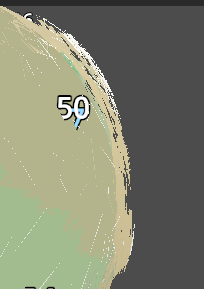
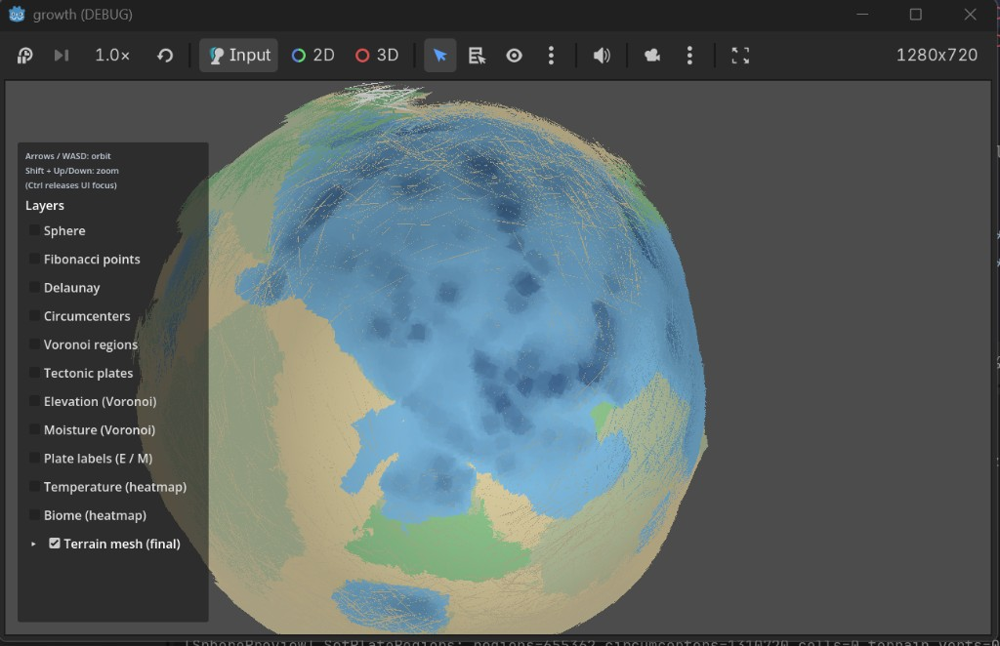
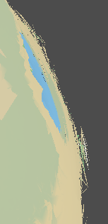
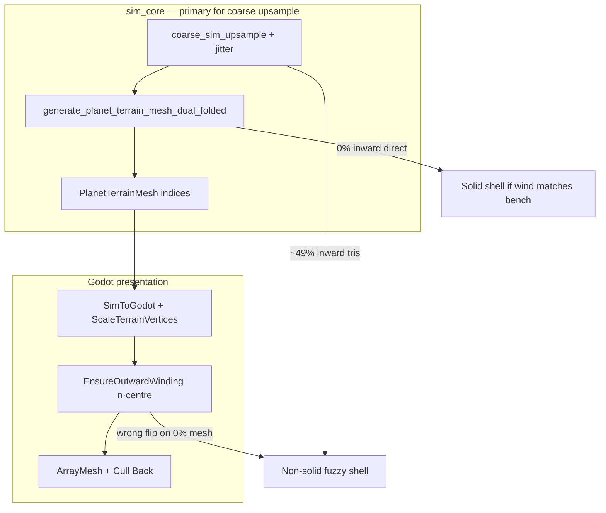

# 001 — Terrain mesh non-solid shell (inside-out / fuzzy silhouette)

**Status:** Resolved (sim) — `ensure_planet_terrain_mesh_outward_winding` post-pass; SC-E2 `gate` enforces &lt; 5% on coarse upsample  
**Area:** `PlanetTerrainMesh` · `PlanetGlobeFieldUpsampler` · `PresentationCoords` · `SpherePreview`  
**Stories:** OW-E12, SC-E2 ([critical_bugs_audit.md §10](../critical_bugs_audit.md))

## Symptom

The watertight terrain mesh does not read as a **solid opaque planet**:

| View | Appearance |
|------|------------|
| Outside | Mostly **transparent** or **wispy** — colours show through a broken shell |
| Silhouette / side | **Dithered, hairy fringe** — not a clean rim (see side-view shot below) |
| Inside (or through gaps) | **Solid** biome colours — like paint on the interior of a hollow ball |







This is **not** a shader prettiness issue: `CreateTerrainMapMaterial` uses opaque, unshaded vertex colour with **back-face culling**. The artefact is **wrong triangle orientation** (and, on some pipelines, **half the triangles still wrong after any per-triangle flip**).

---

## Critical cause (identified)

### 1. Rendering mechanism (why it looks “hollow” and fuzzy)

Godot culls **back faces** (`CullMode.Back`). Only **front-facing** triangles (CCW in view space) are drawn.

- If normals point **inward** (toward the planet centre): the **outside** of the shell is back-facing → **culled** → invisible from outside.
- The **inside** of the shell is front-facing from an exterior camera only where you see through gaps → **solid patches** and **fringe** where some tris are front-facing and some are not.

So the visual is exactly **inconsistent or inverted winding + back-face culling**, not missing mesh data.

### 2. Sim mesh generation (backend) — pipeline-dependent

`worldgen_bench` validates the exported mesh in **sim Z-up** with the same rule as presentation should use:

```cpp
Vec3 centre = (a + b + c) * (1/3);
Vec3 n = (b - a).cross(c - a);
if (n.dot(centre) < 0) ++inverted;  // inward
```

**Measured (local `gde/bin/worldgen_bench.exe`, May 2026):**

| Pipeline case | `inward_tris` |
|---------------|----------------|
| `target=16384` … `524288`, mesh, direct sim | **0.00%** |
| `target=100000`, `sim=50000`, **25% jitter**, mesh (coarse upsample) | **49.21%** |

So:

- **Direct globe → `generate_planet_terrain_mesh_dual_folded`:** indices are already **outward** in sim space; the shell is well-oriented at the source.
- **Coarse sim + field upsample** (common for large worlds): about **half** the triangles fail the outward test — the mesh is **not** a consistent oriented manifold in sim. No Godot-only flip can make that solid without a proper **sim post-pass** (OW-E12).

Root sim code: [`PlanetTerrainMesh.cpp`](../../gde/sim_core/src/world/PlanetTerrainMesh.cpp) — one triangle per half-edge `(r1, r2, region + inner_t)`. The ~50% failure on upsampled globes points to **topology / half-edge orientation after upsample**, not missing vertices.

### 3. Presentation (Godot) — incorrect “fix” made good meshes worse

[`PresentationCoords.EnsureOutwardWinding`](../../godot/autoload/sim/PresentationCoords.cs) runs after `SimToGodot` on displaced vertices.

- `SimToGodot` is **orientation-preserving** (det +1). Winding chirality is unchanged; **0% inward in sim ⇒ 0% should need swapping in Godot** if the same `n·centre` test is used.
- An intermediate change swapped when `n·a > 0` (first vertex only). That **inverts a correct mesh** → uniform inside-out shell.
- **Correct presentation rule:** match bench — use triangle **centroid**, swap when `n·centre < 0`.

Presentation cannot repair a **49% inward** sim mesh; per-triangle flip leaves ~half wrong → **mottled, non-solid side view** (mixed front/back faces at the rim).

---

## Responsibility split



| Layer | Verdict |
|-------|---------|
| **Mesh generation (coarse upsample path)** | **Critical** for large/jittered worlds — ~50% triangles inward in sim |
| **Mesh generation (direct path)** | OK in bench (0% inward) |
| **Godot winding pass** | Must mirror bench; must **not** flip already-good meshes |
| **Render settings** | Not the cause (opaque + back cull is correct for a closed outward shell) |

---

## Fixes

### Done (presentation)

- Two-step index prep in `PresentationCoords.PrepareTerrainMeshIndicesForDisplay`:
  1. `EnsureOutwardWindingSimSpace` — centroid test, swap when `n·centre < 0` (same as `worldgen_bench`).
  2. `FlipAllTriangleWindings` — global swap once so **Godot CCW front faces** match the outward shell (sim export uses the opposite chirality; 4k bench is 0% inward but was still inside-out in-editor without this flip).

### Done (sim) — OW-E12 / SC-E2

- `ensure_planet_terrain_mesh_outward_winding` runs after `generate_planet_terrain_mesh_dual_folded` (centroid test, swap when `n·centre < 0`).
- `worldgen_bench gate` and `python tools/run_worldgen_bench_gate.py` fail CI when inward rate &gt; 5% on the coarse-upsampling reference preset.

### Verify in editor

1. Rebuild `growth.dll` / reload project.
2. World gen on **16384** direct path → solid exterior expected.
3. World gen on **100k + coarse upsample** → may still fuzz until sim fix lands.

---

## Also related (same session)

- Voronoi debug layers drawn on top of terrain → extra hair (fixed via layer menu / `ApplyInitialTerrainView`).
- Layer checkboxes reset by sticky mesh-only mode (fixed in `SpherePreview` / `SpherePreviewOverlay`).
