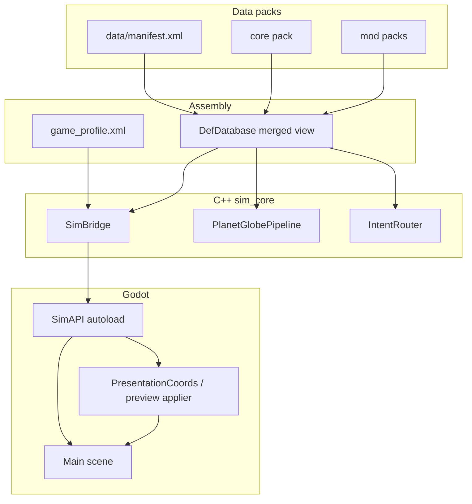

# Moddability architecture

Growth is built as a **content pack engine** with a **composition layer** on top. The running game is always an assembled instance of registered parts, selected by a game profile and merged definition packs. Modders change content and assembly; they do not recompile the engine to swap behaviour that is declared in data.

## Three layers

| Layer | Answers | Modder swaps |
|-------|---------|--------------|
| **Content** | What exists? | XML defs, assets, stamp files |
| **Assembly** | What is active this session? | `game_profile.xml`, pipeline id, presentation bindings |
| **Runtime** | How does it run? | C++ systems and Godot views (stable; registered by id) |



## Pack loading

- Root manifest: `data/manifest.xml` lists packs in `<load_order>`.
- Each pack has `pack_manifest.xml` listing def files.
- **Override rule:** later packs replace entries with the same id (documented for mod authors).
- Only `DefDatabase` parses XML; systems query typed defs by id.

Boot path is the **data root** (`res://data/`), not a single pack folder.

## Definition types (core)

| File | Purpose |
|------|---------|
| `defs/buildings.xml` | Buildings, footprints, effects |
| `defs/interactions.xml` | Player actions, tools, conditions |
| `defs/ui_assets.xml` | Texture paths by asset id |
| `defs/planet_presets.xml` | Planet generation distributions |
| `defs/scene_registry.xml` | Scene and script paths by id |
| `defs/game_profile.xml` | Active presentation and pipeline bindings |
| `defs/world_gen_pipelines.xml` | Ordered world-gen stage list |

## Game scene order

The **load and on-screen order** for the default profile (autoload → `Main` → menus → preview → chunks) is maintained in **[game_scene_order.md](game_scene_order.md)**. Update that file whenever presentation flow or scene bindings change.

## Game profile (assembly)

`game_profile.xml` declares what the session uses:

- **Presentation:** `entry_menu`, `world_gen_load_screen`, `planet_preview` → `scene_id` in `scene_registry.xml`
- **World view:** `world_view` → `script_id` in `scene_registry.xml`
- **World gen:** `pipeline_id` in `world_gen_pipelines.xml`

Godot `Main.gd` boots the data root via `SimAPI` and drives the default presentation flow. Prefer `SimAPI.get_presentation_scene_path` over hardcoded menu or preview paths in gameplay code.

### World-gen preview adapter contract

GrowthSim marshals world-gen output as a Godot `Dictionary`. Key strings are defined once in **`godot/autoload/sim/WorldGenPreviewKeys.cs`** and **`godot/ui/menus/world_gen/WorldGenPreviewKeys.gd`** (keep in sync with `gde/src/WorldGenMarshal.cpp`). `WorldGenResultEngine` normalises arrays; `WorldGenPreviewApplierEngine` applies a `WorldGenPreviewPayload` to `SpherePreview`. Sim space is Z-up; **`PresentationCoords`** converts to Godot Y-up and fixes mesh winding for the renderer. Views must not call `SimAPI` for sim data—only orchestration code does.

## World generation pipeline

Stages are registered in C++ by stable `stage_id` strings. `world_gen_pipelines.xml` lists stage refs in order. `PlanetGlobePipeline` runs the list; mods can supply an alternate pipeline id in a profile (future) or override pipeline defs in a later pack.

Default pipeline `default_globe`: topology → half_edge_mesh → region_neighbours → tectonic_plates → plate_properties → elevation → moisture → triangle_values → priority_flood → river_downflow → river_flow → erosion → terrain_mesh (optional).

## Intents

UI and input send intent dictionaries to `SimAPI.apply_intent`. `IntentRouter` maps `action_type` to handlers. If `interaction_id` is set, `DefDatabase` supplies the interaction def (action type, tool, condition id). Handlers live in C++; mods change which actions appear via `interactions.xml`.

## New code scaffolding

Start from **[templates/README.md](../templates/README.md)** (decision tree, per-template checklists). Generate C++ stubs with `.\tools\new_from_template.ps1` from the repo root. After adding `.cpp` files, run `python tools/lint_sconstruct_sources.py` so `gde/SConstruct` stays in sync.

## Implementation rules (for all new work)

1. No new content ids hardcoded in C++ or Godot gameplay scripts.
2. No XML parsing outside `DefDatabase` / `XmlLite`.
3. No scene paths in gameplay scripts — resolve via `SimAPI.get_scene_path` / profile bindings.
4. New sim features: def type + system (+ optional pipeline stage), not one-off bridge code.
5. Godot displays; C++ decides rules and world state.
6. Document pack override semantics when adding def types.

## Linter (enforcement)

Rules are defined in `tools/moddability_lint.yaml` and checked by:

```bash
pip install -r tools/requirements-lint.txt
python tools/lint_moddability.py
python tools/lint_sconstruct_sources.py
```

`lint_sconstruct_sources.py` ensures new translation units under the active sim_core trees and `gde/src/` are listed in `gde/SConstruct`.

Install as a git hook (optional):

```bash
pip install pre-commit
pre-commit install
```

### Suppressions

Use only when a rule genuinely does not apply; include a short reason:

```gdscript
# moddability:ignore godot_literal_res_path test-only fixture path
var x = load("res://godot/tests/fixture.tscn")
```

```cpp
// moddability:ignore cpp_gde_no_def_xml legacy bridge until removed
```

`moddability:ignore` without a rule id suppresses all rules on that line.

### Rules summary

| Rule id | What it blocks |
|---------|----------------|
| `godot_literal_res_path` | `res://godot/` or `res://data/` string literals in gameplay scripts |
| `godot_def_xml_parse` | Reading def XML from Godot (except `SimAPI` stub) |
| `godot_direct_growth_sim` | `GrowthSim` use outside `SimAPI` autoload |
| `godot_boot_data_root` | Booting with `res://data/core/` instead of `res://data/` |
| `cpp_gde_no_def_xml` | Def XML / `XMLParser` in `gde/src` |
| `cpp_sim_core_xml_layer` | Def XML loading outside `sim_core/src/data/` |
| `cpp_sim_core_external_include` | Any `#include <...>` outside `sim_core/include/base/gateway/` (use `base/gateway/C*.hpp`) |
| `cpp_gde_src_external_include` | Non-Godot `#include <...>` in `gde/src/` (stdlib via `base/gateway/C*.hpp`) |

## Terminology

| Term | Meaning |
|------|---------|
| **Overworld** | Generated macro planet (spherical atlas). |
| **Game world** | Generated micro, streamed, player-editable local simulation. |

## Epics (product / engineering)

| Epic | Doc |
|------|-----|
| Critical issues audit (implementation vs epics) | [critical_bugs_audit.md](critical_bugs_audit.md) |
| Sim API & platform (boot, async gen, profile paths) | [epic_sim_api_platform.md](epic_sim_api_platform.md) |
| Overworld generation (atlas, world gen scenes) | [epic_overworld_generation.md](epic_overworld_generation.md) |
| Sim correctness & QA (bench, topology, determinism) | [epic_sim_correctness.md](epic_sim_correctness.md) |
| Game world streaming (chunks, proc gen from overworld, player edits) | [epic_game_world_streaming.md](epic_game_world_streaming.md) |

Scene-level user stories in those epics map to [game_scene_order.md](game_scene_order.md).

## Phases

| Phase | Status | Deliverable |
|-------|--------|-------------|
| A | Done | `DefDatabase`, manifest load order, core def merge |
| B | Done | `game_profile`, `scene_registry`, thin `Main.gd`, SimAPI paths |
| C | Done | `world_gen_pipelines.xml`, `PlanetGlobePipeline` |
| D | Done | `IntentRouter`, interaction-aware routing |
| E | Done | `data/mods/example/` sample pack |

## Mod authoring (quick start)

1. Add a folder under `data/mods/your_mod/`.
2. Add `pack_manifest.xml` and register the pack in `data/manifest.xml` (after `core`).
3. Override or add defs with the same id scheme as core.
4. Optionally add a `game_profile.xml` with a new `profile_id` and pass that id to `SimAPI.boot(data_root, profile_id)` (default: `default`).

See `data/mods/example/` for a minimal override pack.
