# Growth file templates

Scaffolding for new code across sim_core, GDExtension glue, Godot, and data packs. Nothing here is compiled; copy or generate into the real tree.

**Quick start:** `.\tools\new_from_template.ps1 world StaticClass MyAssigner` (see [Generator](#generator)).

Placeholders: `{{PascalCase}}`, `{{snake_case}}`. Replace manually if not using the script.

## Decision tree

```mermaid
flowchart TD
  start[I want to add...]
  start --> sim{Sim logic?}
  sim -->|yes| cpp{C++ in sim_core?}
  sim -->|no| godot{Godot UI or view?}
  sim -->|data only| data[Use data templates]

  cpp -->|static helpers on sphere data| wc[world/StaticClass]
  cpp -->|mesh struct + generators| wf[world/StructWithFreeFunctions]
  cpp -->|pipeline stage body only| wi[world/Implementation.cpp]
  cpp -->|form / API DTO| ap[api/PlainStruct]
  cpp -->|orchestrator service| as[api/ServiceClass]
  cpp -->|deterministic generator| gn[gen/GeneratorClass]
  cpp -->|ECS component data| ec[ecs/ComponentStruct]
  cpp -->|sim → Godot diff payload| br[bridge/DiffStruct]
  cpp -->|new def type loader| dt[data/DatabaseClass — rare]

  godot -->|C# panel overlay| uc[godot/csharp/UiPanel + scenes/UiPanelCard]
  godot -->|autoload-style facade| ua[godot/csharp/AutoloadFacade — rare]
  godot -->|entity view component| ue[godot/csharp/EntityComponentView]
  godot -->|menu screen| um[godot/gdscript/UiMenu]
  godot -->|Node3D world object| uw[godot/gdscript/WorldNode3D]
  godot -->|main scene bootstrap| umn[godot/gdscript/MainScene]

  data -->|new def file| df[data/core/defs/DefFile + Schema]
  data -->|register scene/script| sr[data/core/defs/scene_registry]
  data -->|session bindings| gp[data/core/defs/game_profile]
  data -->|mod pack| mod[data/mods/mod_manifest]

  wc --> hook1[Register stage in PlanetGlobePipeline]
  wf --> hook1
  godot --> hook2[Optional: SpherePreview layer]
```



### Common paths (examples)

| Goal | Template(s) | Then edit |
|------|-------------|-------------|
| New world-gen assigner / builder | `world/StaticClass` or `StructWithFreeFunctions` | [PlanetGlobePipeline.cpp](gde/sim_core/src/world/PlanetGlobePipeline.cpp), [world_gen_pipelines.xml](data/core/defs/world_gen_pipelines.xml), `gde/SConstruct` |
| New pipeline stage implementation only | `world/Implementation.cpp` | Same pipeline files + existing header |
| New planet / seed API field | `api/PlainStruct` + `gde/GodotAdapter` | [WorldGenFormParser.cpp](gde/src/WorldGenFormParser.cpp), Godot form menus |
| New UI overlay panel | `godot/csharp/UiPanel` + `godot/scenes/UiPanelCard` | [scene_registry.xml](data/core/defs/scene_registry.xml), parent scene, [ui_assets.xml](data/core/defs/ui_assets.xml) |
| New entry / flow menu | `godot/gdscript/UiMenu` | [game_profile.xml](data/core/defs/game_profile.xml) presentation binding |
| New mod interaction | `data/mods/mod_manifest` + `DefFile` | [data/manifest.xml](data/manifest.xml) load order |
| New math type | **Do not use math templates** — copy [Vector.hpp](gde/sim_core/include/math/Vector.hpp) layout | [Math.hpp](gde/sim_core/include/math/Math.hpp) if umbrella |

## Generator

From repo root:

```powershell
.\tools\new_from_template.ps1 <layer> <template> <Name> [-Force]
.\tools\new_from_template.ps1 -List
```

Examples:

```powershell
.\tools\new_from_template.ps1 world StaticClass RegionSmoothing
.\tools\new_from_template.ps1 api PlainStruct
.\tools\new_from_template.ps1 gde GodotAdapter MyFormParser
```

After generation, run:

```powershell
python tools/lint_sconstruct_sources.py
python tools/lint_moddability.py
```

## Canonical sources of truth

When a pattern changes in production, update the **canonical file** first, then align the matching template.

| Pattern | Canonical file | Template |
|---------|----------------|----------|
| Stdlib gateway (`<cmath>`, `<cstdint>`, …) | [base/gateway/Cmath.hpp](gde/sim_core/include/base/gateway/Cmath.hpp), [Types.hpp](gde/sim_core/include/Types.hpp) | `base/StdlibWrapper` |
| 2D/3D vector math | [Vector.hpp](gde/sim_core/include/math/Vector.hpp), [Scalar.hpp](gde/sim_core/include/math/Scalar.hpp) | `math/TypeAlias`, `math/ScalarFunctions` only |
| Umbrella includes | [Math.hpp](gde/sim_core/include/math/Math.hpp), [Util.hpp](gde/sim_core/include/util/Util.hpp) | `math/UmbrellaModule`, `util/UmbrellaUtil` |
| Static world helper | [SphereDual.hpp](gde/sim_core/include/world/SphereDual.hpp) | `world/StaticClass` |
| Terrain mesh + free functions | [PlanetTerrainMesh.hpp](gde/sim_core/include/world/PlanetTerrainMesh.hpp) | `world/StructWithFreeFunctions` |
| Pipeline stages | [PlanetGlobePipeline.cpp](gde/sim_core/src/world/PlanetGlobePipeline.cpp) | `world/Implementation` |
| Godot form → C++ | [WorldGenFormParser.cpp](gde/src/WorldGenFormParser.cpp) | `gde/GodotAdapter` |
| Card UI panel | [SpherePreviewOverlay.tscn](godot/ui/panels/SpherePreviewOverlay.tscn), [SpherePreviewOverlay.cs](godot/ui/panels/SpherePreviewOverlay.cs) | `godot/scenes/UiPanelCard`, `godot/csharp/UiPanel` |
| World gen menu | [WorldGenMenu.gd](godot/ui/menus/WorldGenMenu.gd), [world_gen/](godot/ui/menus/world_gen/) | `godot/gdscript/UiMenu` |
| SimAPI autoload | [SimAPI.cs](godot/autoload/SimAPI.cs), engines in [autoload/sim/](godot/autoload/sim/) | `godot/csharp/AutoloadFacade` (reference only) |
| Pack manifest | [data/core/manifest.xml](data/core/manifest.xml) | `data/core/pack_manifest` |

## Layer map

| Layer | Path in repo | Templates |
|-------|----------------|-----------|
| Sim core (external gateways) | `gde/sim_core/include/base/gateway/` | `sim_core/base/gateway/StdlibWrapper` |
| Sim core (math) | `gde/sim_core/include/math/` | `sim_core/math/` — see canonical Vector/Scalar |
| Sim core (world) | `gde/sim_core/include/world/`, `src/world/` | `sim_core/world/` |
| Sim core (api) | `gde/sim_core/include/api/`, `src/api/` | `sim_core/api/` |
| Sim core (bridge) | `gde/sim_core/include/bridge/` | `sim_core/bridge/` |
| Sim core (gen) | `gde/sim_core/include/gen/`, `src/gen/` | `sim_core/gen/` |
| Sim core (data) | `gde/sim_core/include/data/`, `src/data/` | `sim_core/data/` |
| Sim core (util) | `gde/sim_core/include/util/` | `sim_core/util/` |
| Sim core (ecs) | `gde/sim_core/include/ecs/` | `sim_core/ecs/` |
| GDExtension glue | `gde/src/` | `gde/` |
| Godot C# | `godot/` | `godot/csharp/` |
| Godot GDScript | `godot/` | `godot/gdscript/` |
| Godot scenes | `godot/**/*.tscn` | `godot/scenes/` |
| Data packs | `data/core/`, `data/mods/*/` | `data/` |

## Conventions (sim_core C++)

- `#pragma once`, `namespace growth { … } // namespace growth`
- Tab indentation; includes from sim_core root (`"world/Foo.hpp"`)
- **No direct `#include <cmath>` / `<cstdint>` / `<cstddef>`** outside `include/base/gateway/` — use `Cmath`, `Types.hpp` (`U32`, `Size`), `math/Scalar.hpp` for domain math
- No Godot headers in `sim_core/`
- `///` on public types and non-obvious methods
- Math operator layout: see [Vector.hpp](gde/sim_core/include/math/Vector.hpp) (binary → compound → compare → core → helpers)

## Template checklists

### `sim_core/base/StdlibWrapper`

- [ ] `gde/sim_core/include/base/gateway/{{ClassName}}.hpp` — sole `#include <{{std_header}}>` for that header in sim_core
- [ ] Static methods (or type aliases) on `struct {{ClassName}} final` with deleted default ctor
- [ ] `#include "{{ClassName}}.hpp"` in [base/gateway/Gateway.hpp](gde/sim_core/include/base/gateway/Gateway.hpp)
- [ ] Domain code uses `growth::{{ClassName}}::…` or aliases in [Types.hpp](gde/sim_core/include/Types.hpp); never the raw std header

### `sim_core/world/StaticClass`

- [ ] `gde/sim_core/include/world/{{ClassName}}.hpp`
- [ ] `gde/sim_core/src/world/{{ClassName}}.cpp`
- [ ] Add `"sim_core/src/world/{{ClassName}}.cpp"` to [gde/SConstruct](gde/SConstruct) `sources`
- [ ] Register `stage_id` in [world_gen_pipelines.xml](data/core/defs/world_gen_pipelines.xml) if part of globe gen
- [ ] Wire stage function in [PlanetGlobePipeline.cpp](gde/sim_core/src/world/PlanetGlobePipeline.cpp)
- [ ] Optional: preview hook in [SpherePreview.cs](godot/debug/SpherePreview.cs) + overlay checkbox in [SpherePreviewOverlay](godot/ui/panels/SpherePreviewOverlay.tscn)
- [ ] `python tools/lint_sconstruct_sources.py`

### `sim_core/world/StructWithFreeFunctions`

- [ ] Header under `include/world/`; implementation `.cpp` under `src/world/`
- [ ] SConstruct entry for `.cpp`
- [ ] Call site(s) from pipeline or [PlanetGlobeGenerator](gde/sim_core/include/world/PlanetGlobeGenerator.hpp)
- [ ] If user-facing preset behaviour: [planet_presets.xml](data/core/defs/planet_presets.xml) comment + form field via `ParsedWorldGenForm`

### `sim_core/world/Implementation.cpp`

- [ ] `.cpp` only (header already exists)
- [ ] SConstruct + pipeline stage registration (same as StaticClass)

### `sim_core/api/PlainStruct`

- [ ] `gde/sim_core/include/api/{{StructName}}.hpp`
- [ ] Extend [WorldGenFormParser](gde/src/WorldGenFormParser.cpp) / `gde/GodotAdapter` for new fields
- [ ] Godot form dict keys in menu GDScript ([WorldGenMenu.gd](godot/ui/menus/WorldGenMenu.gd))
- [ ] Consumers: [WorldGenRunner](gde/sim_core/include/api/WorldGenRunner.hpp), preview export if needed

### `sim_core/api/ServiceClass`

- [ ] `.hpp` + `.cpp` under `api/`
- [ ] SConstruct: `sim_core/src/api/{{ClassName}}.cpp`
- [ ] Register caller (e.g. `PlanetGlobeGenerator`, `SimBridge`)

### `sim_core/gen/GeneratorClass`

- [ ] Header (+ `.cpp` if not header-only)
- [ ] SConstruct if `.cpp` added
- [ ] Used from [WorldGenRunner](gde/sim_core/src/api/WorldGenRunner.cpp) or blueprint path

### `sim_core/bridge/DiffStruct`

- [ ] `include/bridge/` header
- [ ] Extend [DiffConverter](gde/src/DiffConverter.cpp) + Godot `SimAPI` diff constants
- [ ] Godot subscriber (world view / chunk node)

### `sim_core/ecs/ComponentStruct`

- [ ] Header only; register type with [Registry](gde/sim_core/include/ecs/Registry.hpp) at use site
- [ ] Systems that add/remove/query component

### `sim_core/data/DatabaseClass`

- [ ] Rare — extend [DefDatabase](gde/sim_core/include/data/DefDatabase.hpp) + merge for new XML def kind
- [ ] New def file + XSD + [pack manifest](data/core/manifest.xml) entries

### `gde/GodotAdapter`

- [ ] `gde/src/{{AdapterName}}.hpp` + `.cpp`
- [ ] Add both to [gde/SConstruct](gde/SConstruct) `sources` (under `src/`, not `sim_core/`)
- [ ] Call from [sim_api_gdextension.cpp](gde/src/sim_api_gdextension.cpp) if exposing new API

### `godot/csharp/UiPanel` + `godot/scenes/UiPanelCard`

- [ ] `.cs` + `.tscn` under `godot/ui/panels/` (or appropriate folder)
- [ ] [scene_registry.xml](data/core/defs/scene_registry.xml): new `scene_id`
- [ ] Parent scene instances panel or loads by `SimAPI.get_scene_path`
- [ ] [ui_assets.xml](data/core/defs/ui_assets.xml) for `panel_card` / buttons if used
- [ ] No `res://` literals in gameplay scripts (moddability lint)

### `godot/gdscript/UiMenu`

- [ ] `.gd` + `.tscn` pair
- [ ] `scene_registry.xml` + [game_profile.xml](data/core/defs/game_profile.xml) presentation binding
- [ ] Form keys match C++ `ParsedWorldGenForm` / parser

### `godot/gdscript/WorldNode3D` / `MainScene`

- [ ] Scene + script; registry + profile if entry/world root
- [ ] `Main.gd` only loads paths from profile (no hardcoded menu paths)

### `data/core/defs/DefFile` + `schemas/Schema`

- [ ] New `defs/{{file}}.xml` + `schemas/{{file}}.xsd`
- [ ] Register both in [data/core/manifest.xml](data/core/manifest.xml) `<defs>` and `<schemas>`
- [ ] Merge function in `DefDatabase` if new def **type** (not just new rows in existing XML)

### `data/mods/mod_manifest`

- [ ] Mod folder under `data/mods/{{mod}}/`
- [ ] Register pack in [data/manifest.xml](data/manifest.xml) `<load_order>` after `core`

## Godot rules

- **SimAPI** is the only GDExtension entry from gameplay C#.
- UI hierarchy: `MarginContainer` → `Card` → `CardPadding` → `VBox` / rows (see canonical overlay scene).
- C#: `partial class`, XML docs on public API, `GetNodeOrNull` paths.
- GDScript: `##` file doc, `_snake_case` privates, `SimAPI` for paths.

## Enforcement

| Tool | Purpose |
|------|---------|
| `python tools/lint_sconstruct_sources.py` | Every `sim_core/src/**/*.cpp` and `gde/src/*.cpp` is listed in `gde/SConstruct` |
| `python tools/lint_moddability.py` | Data-driven architecture (no hardcoded defs/paths) |
| [.cursor/rules/growth-templates.mdc](.cursor/rules/growth-templates.mdc) | **Always on:** check templates before new work; update templates when patterns change |

Optional: `pre-commit install` runs both lints (see [.pre-commit-config.yaml](.pre-commit-config.yaml)).

### Cursor agents

1. **Before** — decision tree + `new_from_template.ps1` + checklist (see cursor rule).
2. **After** — if you changed a canonical pattern (UI card, pipeline stage, form parser, defs), update the matching `.template` and README canonical table in the same change.
